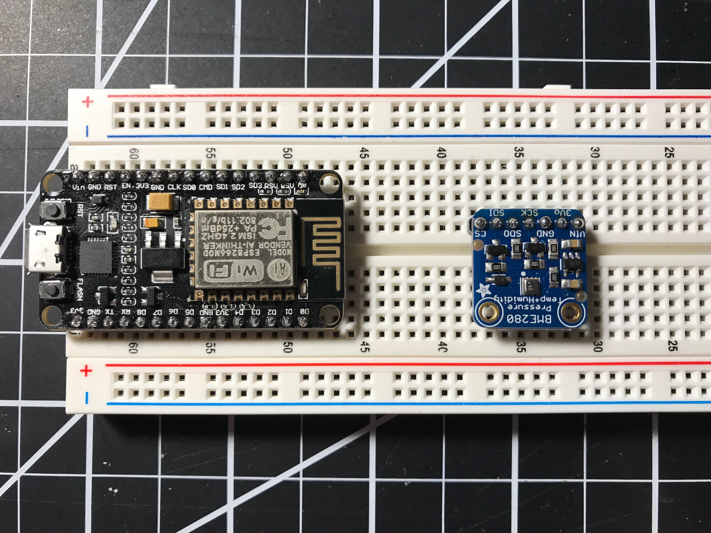

# Pi Weather Station - D2 Progress Report

| Name | email     |
| :------------- | :------------- |
| Jared Ham      | jaredlham@gmail.com      |
| \*Stephen Sutherland | haka24@rams.colostate.edu |
| Thomas Vogenthaler | ThomasVogue7@gmail.com |
| Hunter Sullivan     | hs.sknow@gmail.com   |

---

# Boards and Additional Hardware

## Raspberry Pi Model 3

## ESP8266 - WiFi Development Board

* Used to interface with the BME280.
* Will communicate with the Pi over WiFi using built in WiFi chip.
* Will be powered using a 450mAh Lithium Polymer Battery
* Estimated Power Consumption of the Device:
    * Measured Power On Current Draw (with BME 280 plugged in): 92mA
    * This gives an estimated battery life of: 4.9hrs
    * In order to increase the battery life will only sample data every 10 minutes, and we will put the ESP8266 into deep sleep mode when not sampling.
        * This results in a measured current draw of: 9mA
        * Increasing the battery life to (assuming the non sleep time is negligible): 50hrs
        * If we want to increase the battery life further we can use lower power communication such as Bluetooth instead of WiFi.

## BME280 - Temperature, Pressure and Humidity Sensor
* Sensor communicates with the ESP8266 using the I2C protocol
* Resolution and Accuracy of the Sensor:
   * ± 1&deg;C = 1.8&deg;F
       * More than adequate for a weather Station
   * ±3% Humidity
   * ±100 Pa
       * Standard atmospheric pressure is 101325 Pa
       * This gives accuracies around ±0.1% at the values we expect to measure
